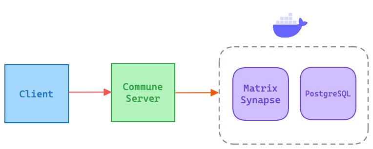

# Contributing to Rust Commune

There are many ways to contribute to Commune Rust, including writing code,
openning issues, helping people, reproduce, or fix bugs that people have filed
and improving documentation.

## Development Environment

Commune Rust is written in The Rust Programming Language, you will have to
setup Rust in your machine to run the project locally.

Tools like [**Justfile**][justfile] are recommended to improve DX and reduce
learning curve by running commands easily.

[docker]: https://www.docker.com/get-started/
[justfile]: https://github.com/casey/just
[rust]: https://rustup.rs


### Getting Started

1. Create a copy of `.env.example` on `.env`

```bash
cp .env.example .env
```

2. Generate `Synapse` server configuration

```bash
just gen_synapse_conf
```

3. Run Synapse Server (and other containerized services) using Docker Compose
via:

```bash
just backend
```

**When you are ready**

Teardown services using `just stop`. If you want to perform a complete cleanup
use `just clear`.

> **Warning** `just clear` will remove all containers and images.

### Testing

This application has 2 layers for tests:

- `Unit`: Are usually inlined inside crates, and dont depend on any integration
- `E2E`: Lives in `test` crate and counts with the services that run the application

#### Unit

Unit tests can be executed via `cargo test -p <crate name>`, this will run
every unit test.

#### E2E

You must run Docker services as for development. In order to avoid messing up
the development environment, its recommended to use the synapse setup from
`crates/test/fixtures/synapse` replacing it with `docker/synapse`.

The only difference should be the `database` section, which uses SQLite instead.

```diff
database:
+  name: psycopg2
+  args:
+    database: /data/homeserver.db
-  name: psycopg2
-  txn_limit: 10000
-  allow_unsafe_locale: true
-  args:
-    user: synapse_user
-    password: secretpassword
-    database: synapse
-    host: localhost
-    port: 5432
-    cp_min: 5
-    cp_max: 10
```

> Make sure the `.env` file is created from the contents on `.env.example`

### Application Layout

<div align="center">
  
  <small>Application Layout Overview</small>
</div>

The client, any HTTP Client, comunicates with the Commune Server which may or
may not communicate with Matrix's server _Synapse_ which runs along with its
database in a Docker container.

#### Email Development

Use [MJML Editor][mjml] and then render into HTML. Make sure variables use
Handlebars syntax (e.g. `{{name}}`).

For local testing you can use something like:

```bash
curl -s http://localhost:1080/email | grep -o -E "This is your verification code.{0,7}" | tail -1 | sed 's/^.*://' | awk '{$1=$1;print}
```

To get the very last email's verification code.

>  **Warning** Note that changes on email content will break this script

[mjml]: https://mjml.io/try-it-live/99k8regCo_

#### Redis

A Redis instance is used to keep in-memory short-lived data used certain server
operations such as storing verification codes.

For this purpose Redis is served as part of the development stack on Docker.

The `redis/redis-stack` image contains both Redis Stack server and RedisInsight,
you can use RedisInsight by pointing your browser to `localhost:8001`.
